# link-prediction
---

Recommending joint collaboration between academics using Python and Machine Learning (LightGBM)

## Running instructions

---

1. clone or download the repository
2. cd (change directory) to the downloaded repository
3. run jupyter notebook ([Install](https://jupyter.org/install) if you haven't)
4. wait until your browser is opened, then click on the file 'Preprocess Data.ipynb'
5. After running the code block, open 'Model Training, Testing and Evaluation.ipynb'

## Highlights

---

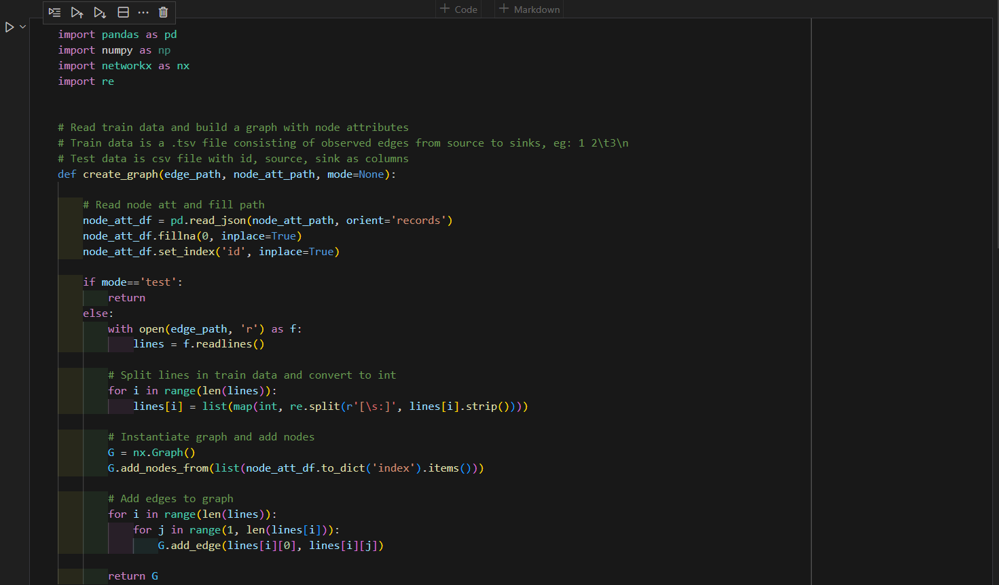
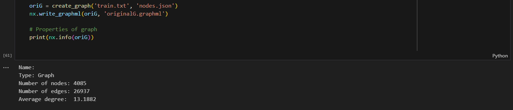
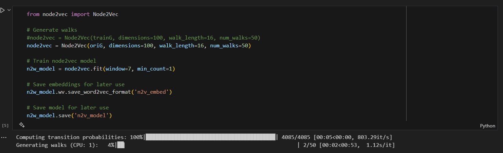
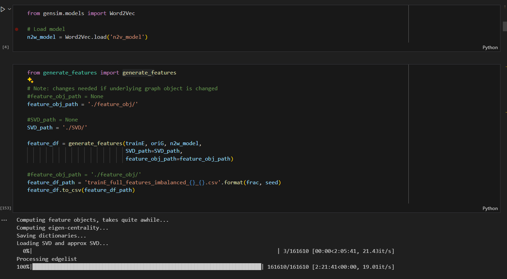
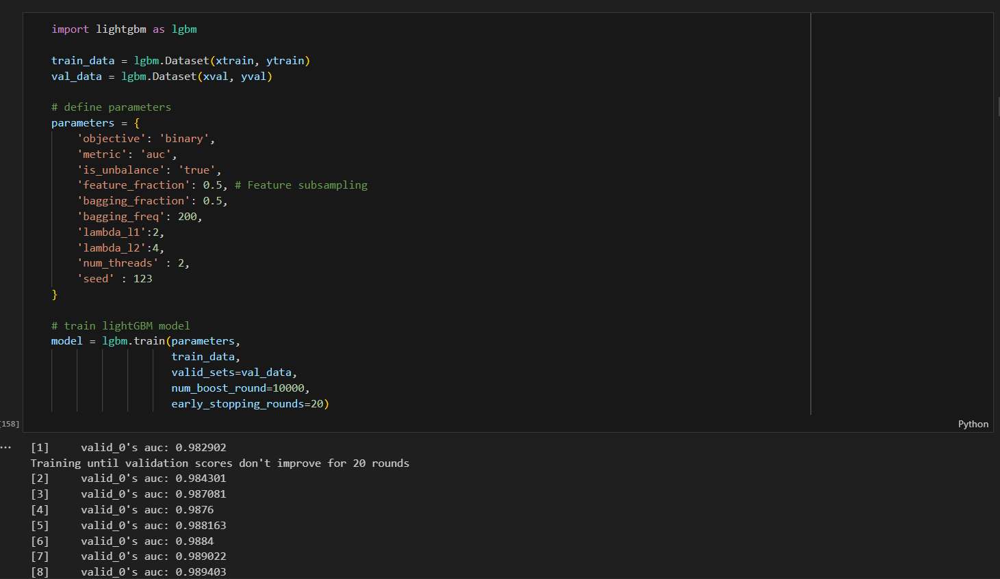
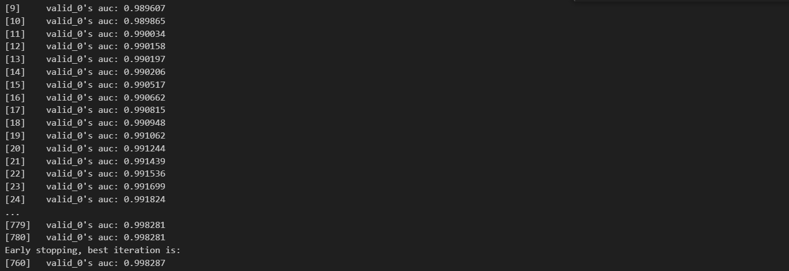
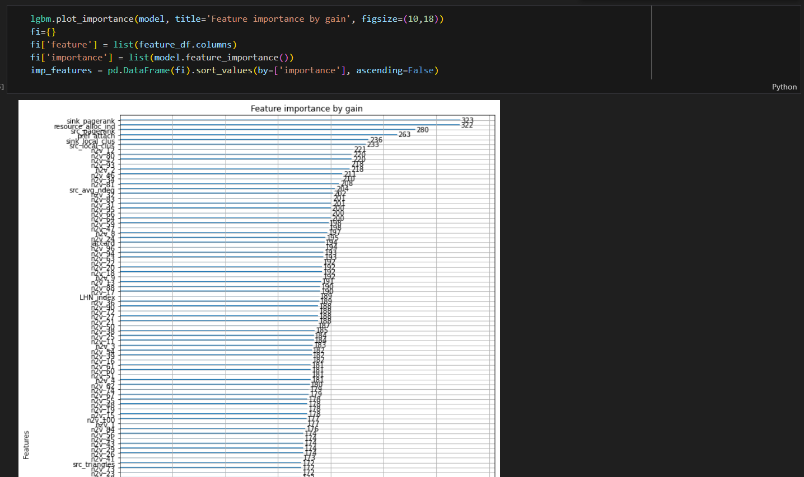
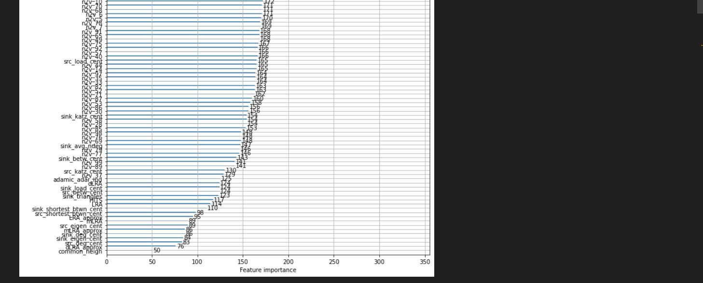
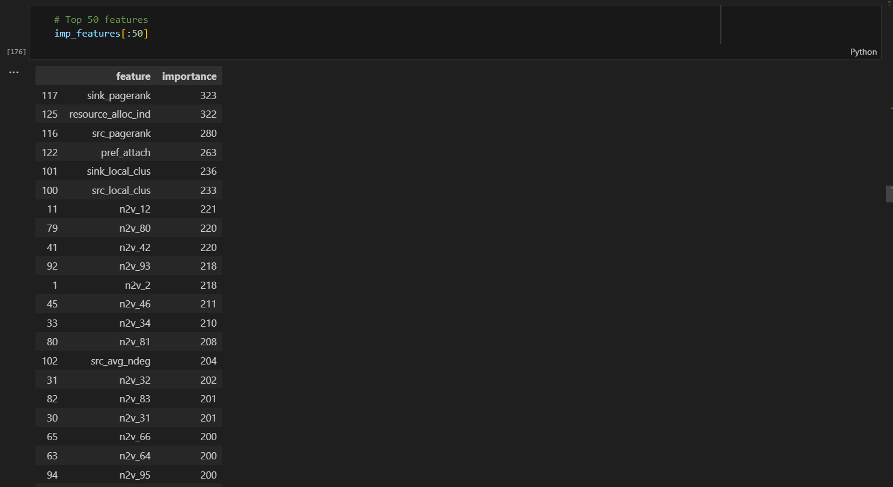
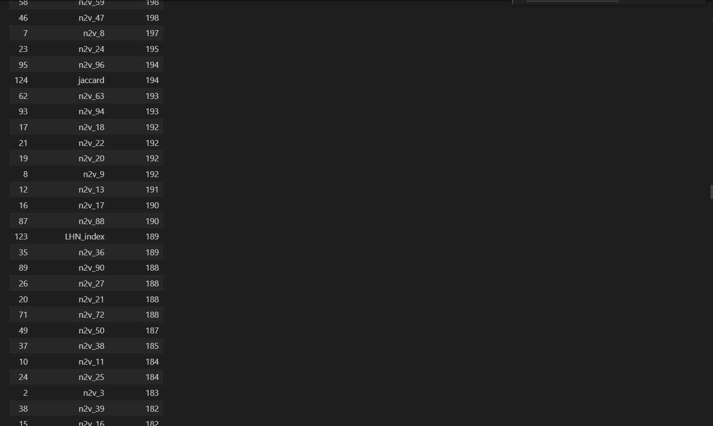
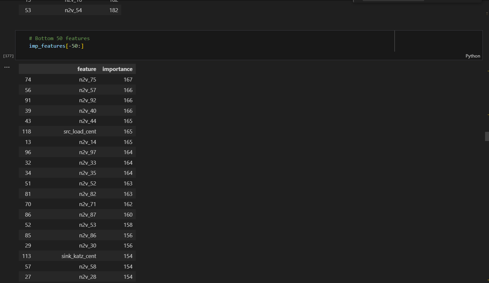
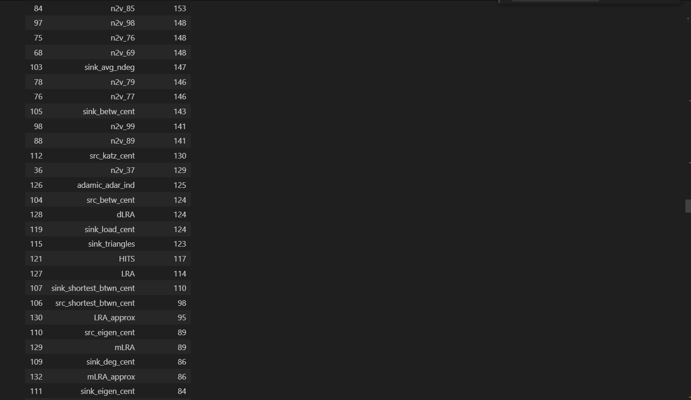
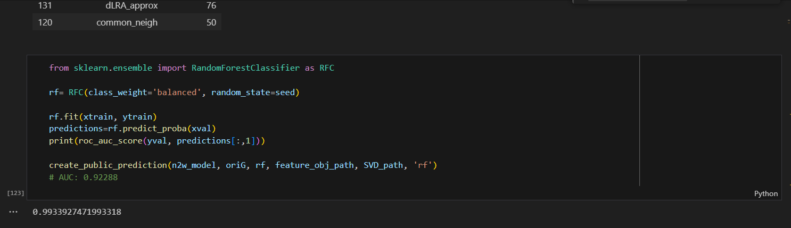
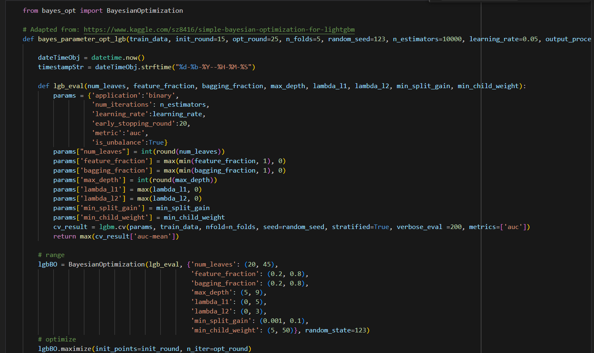
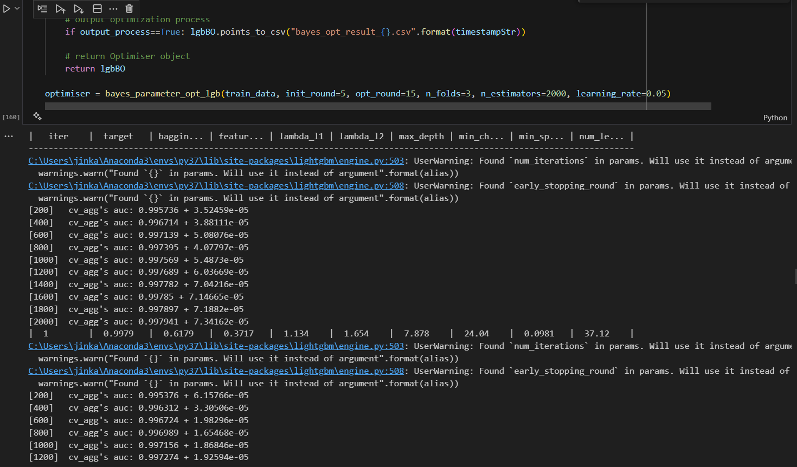
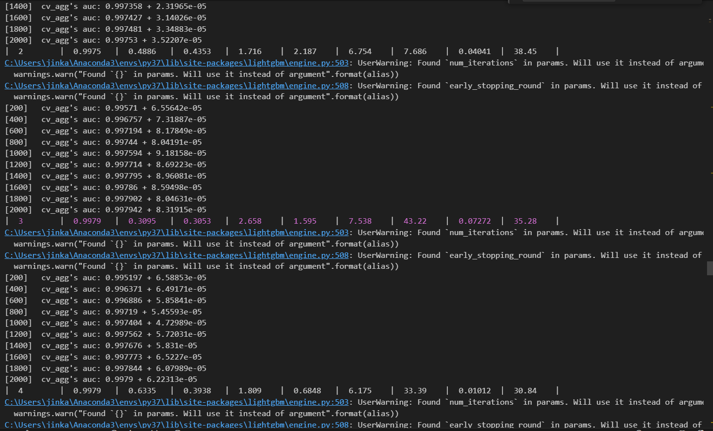
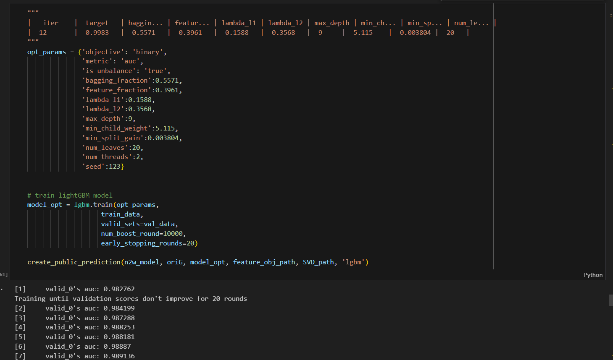
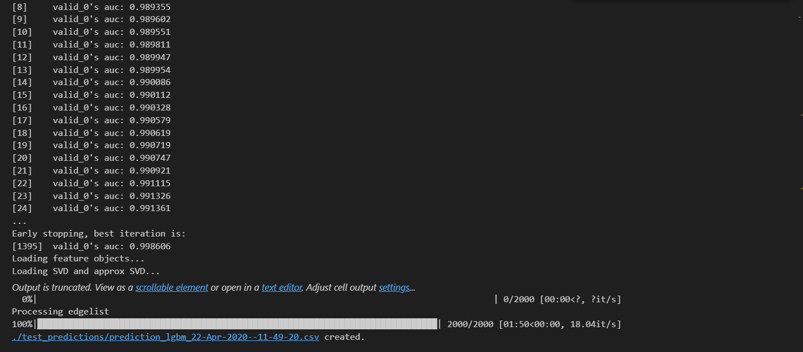
